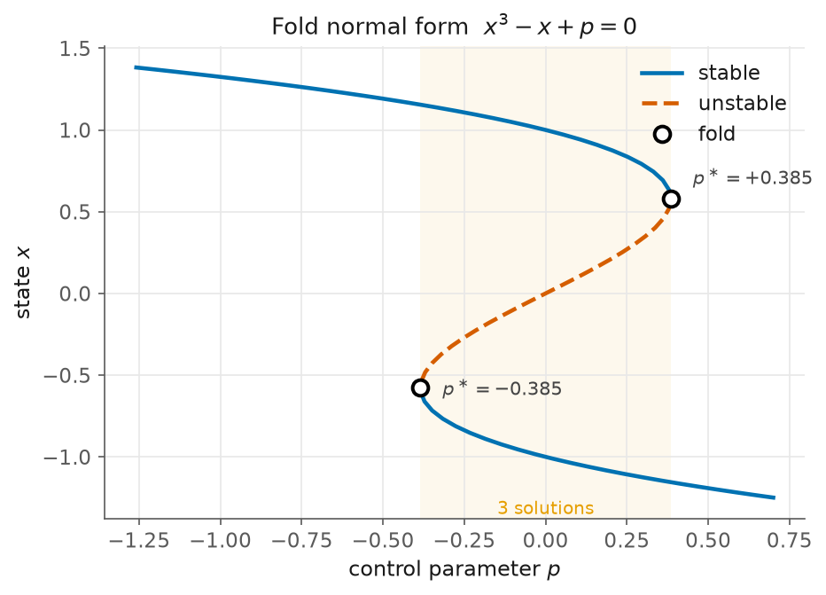

# 1 — The fold

> Script: [`examples/cubic_fold.py`](../examples/cubic_fold.py) · run it to regenerate the figure.

Start with the simplest problem that breaks naive continuation:

$$R(x, p) = x^3 - x + p = 0.$$

For $|p| < 2/(3\sqrt3) \approx 0.385$ this cubic has **three** real roots; outside
that window, one. The two roots that annihilate at each end are a **fold** (a
saddle-node / turning point): the solution branch, drawn in the $(p, x)$ plane, is
an S lying on its side.



## Why naive stepping fails

Fix $p$, Newton-solve for $x$, nudge $p$, repeat. At the fold the branch is
*vertical* — $\mathrm{d}x/\mathrm{d}p = \infty$ and $\partial R/\partial x = 3x^2-1 = 0$
is singular. Just past the fold there is no nearby root, so the next solve jumps to
the far branch or diverges. Folds are generic, so this is the common case.

## The fix, in code

Pseudo-arclength continuation reparametrises the branch by arclength and solves a
bordered system that stays non-singular through the turning point. In kellax that
is one call — you never see the bordering:

```python
R = lambda x, p: jnp.array([x[0]**3 - x[0] + p])
br = arclength_continuation(R, jnp.array([-1.2]), p0=0.7, ds=0.03, ds_max=0.06,
                            n_steps=600, p_min=-1.2, p_max=1.2, direction=-1.0)
# traced 80 points; 2 turning points detected
```

`br.turning_points` holds the indices where the tangent's $p$-component changed
sign — the folds. That only *brackets* them to within a step; **`refine_fold`**
pins each to Newton precision by solving the Moore–Spence augmented system:

```python
for i in br.turning_points[:2]:
    xf, pf, vf, res = refine_fold(R, jnp.array(br.x[i]), float(br.p[i]))
# refined fold: p = -0.3849001795  (exact -2/(3√3)),  x = -0.577350,  residual 5.6e-17
# refined fold: p = +0.3849001795  (exact +2/(3√3)),  x = +0.577350,  residual 5.6e-17
```

Ten correct digits, residual at machine epsilon.

## What to notice

- **Stability is read off the Jacobian.** With the gradient-flow reading
  $\dot x = -R$, a branch point is stable where every eigenvalue of $-\partial R/\partial x$
  is negative — here the two outer arms. The figure draws stable solid, unstable
  dashed (a non-colour cue, so it survives greyscale). The middle arm, between the
  folds, is unstable — the classic hysteresis picture.
- **Autodiff does the calculus.** You wrote only `R`. The Jacobian $\partial R/\partial x$,
  the parameter derivative $\partial R/\partial p$, and (for the refinement) the
  second-derivative term $\partial(R_x v)/\partial x$ all came from `jax.jacfwd`.

Background: the vault note *Pseudo-arclength continuation* and *Folds &
Moore–Spence*.

Next: [the cusp](02-the-cusp.md) — what happens to these two folds as a second
parameter turns them into a curve.
