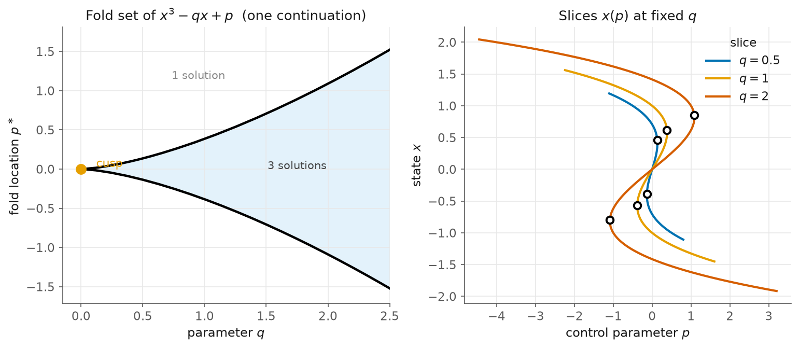

# 2. The cusp

> Script: [`examples/cusp.py`](../examples/cusp.py) · run it to regenerate the figure.

A fold is **codimension-1**: one condition must hold, namely that $\partial R/\partial x$ be singular. Thus, under one control parameter a fold survives as an isolated point. Suppose we now add a *second* parameter to the problem. The fold is then no longer a point but a **curve**: the locus of turning points for a varying set of conditions. Familiar examples of such a curve include a spinodal, an ignition boundary and the edge of a hysteresis region. Take the cusp normal form:

$$R(x, p, q) = x^3 - q x + p = 0.$$

For each $q>0$ there are two folds, located at $x=\pm\sqrt{q/3}$ and $p=\pm 2(q/3)^{3/2}$. As $q\to0$ the two folds approach each other and merge at the **cusp point** $(q,p)=(0,0)$. The two fold curves bound the wedge of parameter values in which the system has three solutions.



## Tracking the fold set

The call `track_fold` begins with the refinement of one fold. Pseudo-arclength continuation in $q$ can then be run directly on the Moore–Spence augmented system itself. Therefore, every point of the returned curve is a converged fold. Its accuracy is a matter of the Newton tolerance and not of the step size.

```python
R2 = lambda x, p, q: np.array([x[0]**3 - q*x[0] + p])
up   = track_fold(R2, np.array([+0.408]), p0 = +0.136, q0 = 0.5, q_max = 2.5, direction = +1.0)
thru = track_fold(R2, np.array([+0.408]), p0 = +0.136, q0 = 0.5, q_max = 2.5, direction = -1.0)
```

## The nice part: one continuation, both arms

Tracking *down* in $q$ from the $+$ fold does not stop at the cusp. The continuation passes smoothly through the cusp and onto the $-$ arm. Indeed, the cusp is singular only in the projection onto the $(q,p)$ plane. In the full $(x, q, p)$ space the fold set is a single smooth curve:

$$q = 3x^2, \qquad p = 2x^3,$$

parametrised by $x$. Thus, arclength walks straight along it. The cusp itself is merely a **turning point in $q$**, where $\mathrm{d}q/\mathrm{d}s = 0$, and kellax detects it and reports:

```
traced the full fold set in ONE pass through the cusp: 45 points, x in [-0.920, +0.938]
  cusp registered as a turning point of the fold curve: True (1 found)
  max error vs law q = 3x^2, p = 2x^3:  4.44e-16
```

We find machine precision along the entire curve and at the cusp itself. The left panel of the figure plots this single curve, with the two arms traced end to end. The right panel shows a set of $x(p)$ slices at fixed $q$. Notice that the fold pair visibly widens as $q$ grows.

## What to notice

Notice that sorting by $x$ untangles the projection. Because $x$ is monotone along the whole fold set, sorting the tracked points by $x$ draws the cusp in a single clean stroke through the origin. No special treatment of the tip is required.

Moreover, the second derivative comes for free. The augmented residual contains the term $\partial R/\partial x\, v$. To continue this term we need one more level of derivatives, and `jax.jacfwd` supplies them without a hand-coded Hessian.

Background: Govaerts (2000) on Moore–Spence systems; Kuznetsov, *Elements of
Applied Bifurcation Theory*.

Next: in [Bratu–Gelfand](03-bratu.md) we apply the same tools to a discretised PDE.
