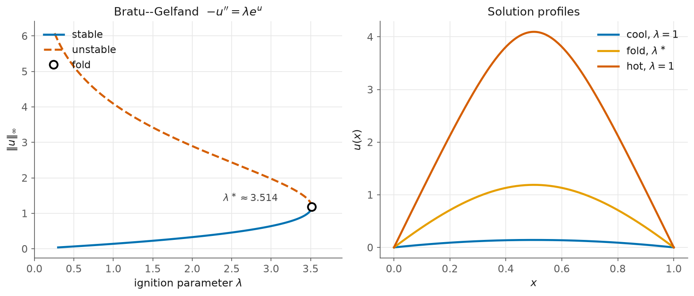

# 3. Bratu–Gelfand: a fold in a boundary-value problem

> Script: [`examples/bratu.py`](../examples/bratu.py) · run it to regenerate the figure.

In what follows, we meet the same fold in a boundary-value problem. The Bratu–Gelfand problem is a model of solid-fuel ignition by thermal runaway:

$$-u''(x) = \lambda\, e^{u(x)}, \qquad x\in(0,1), \qquad u(0)=u(1)=0.$$

This equation is *the* canonical boundary-value problem of numerical continuation. AUTO, MatCont and BifurcationKit all ship it. For $\lambda$ below a critical ignition value the problem has two steady states: a **cool** one and a **hot** one. The two collide at a fold. Above the fold no steady state exists and the system runs away.



## Discretise, then continue

Second-order finite differences on $N=200$ interior points turn the BVP into $R(u,\lambda)=D_2 u + \lambda e^{u}=0$, which is a system of $N$ equations. The discretisation is the only modelling step of the whole computation. All of the Jacobians are then obtained by kellax through automatic differentiation of $R$.

```python
D2 = (np.diag(-2*np.ones(N)) + np.diag(off, 1) + np.diag(off, -1)) / h**2
R  = lambda u, lam: D2 @ u + lam*np.exp(u)

br = arclength_continuation(R, np.zeros(N), p0 = 0.3, ds = 0.03, ds_max = 0.15,
                            n_steps = 900, p_min = 0.25, p_max = 6.0, direction = 1.0)
i = br.turning_points[0]
_, lam_f, _, res = refine_fold(R, np.array(br.x[i]), float(br.p[i]))
# refined fold: lambda* = 3.513785  (reference 3.513831, diff 4.5e-5),  res 2.9e-11
```

The refined turning point matches the known 1-D Bratu value $\lambda^\ast = 3.513831\ldots$ to within the $O(h^2)$ discretisation error. Halve $h$ and the gap quarters.

## Stability comes from the spectrum

The physical time evolution is $u_t = u_{xx} + \lambda e^{u}$. Thus, a steady state is stable if and only if every eigenvalue of $\partial R/\partial u = D_2 + \lambda\,\mathrm{diag}(e^{u})$ is negative. The stability flips exactly at the fold. Therefore, the cool lower branch is stable and the hot upper branch is unstable. The left panel of the figure plots $\lVert u\rVert_\infty$ against $\lambda$ with the same solid and dashed styling as before. The right panel shows the three profiles: cool, at the fold and hot. The hot profile is a tall thermal spike.

## What to notice

Notice that nothing about the method has changed. The exact calls of [chapter 1](01-the-fold.md) work on a 200-dimensional discretised field, and only the residual is different.

Moreover, this example marks the crossover point. At $N=200$ the dense engine can form $\partial R/\partial u$ and factorise it in an instant. Push $N$ into the tens of thousands with a 2-D or a 3-D field and the matrix can no longer be formed. Such problems are the subject of the matrix-free engine and of the *snaking* chapter.

Background: Seydel, *Practical Bifurcation and Stability Analysis* (BVP
continuation); Allgower & Georg, *Numerical Continuation Methods*.

Next: in [scaling up](04-matrix-free.md) we repeat the same trace in matrix-free form, and in [homoclinic snaking](05-snaking.md) we turn to the Swift–Hohenberg equation.
