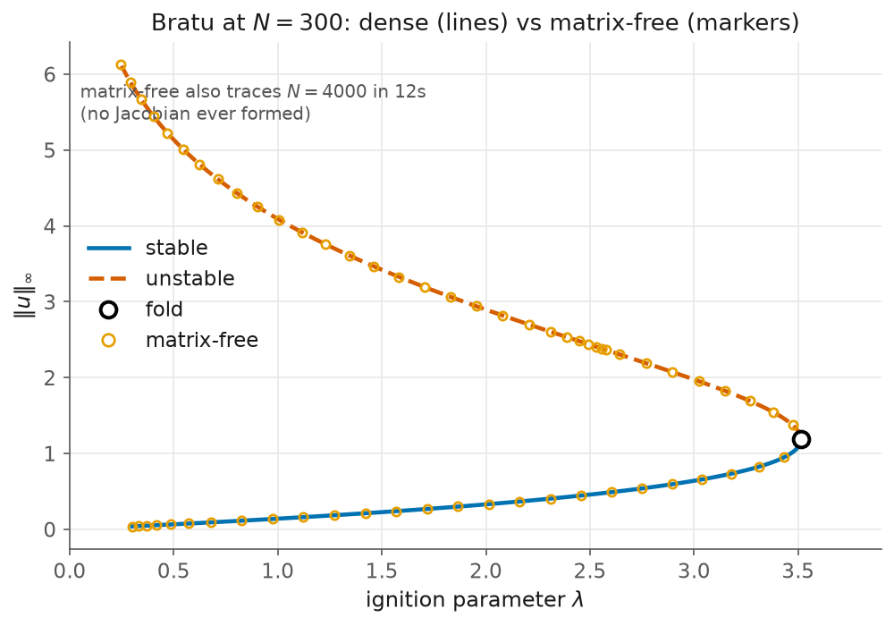

# 4 — Scaling up: matrix-free continuation

> Script: [`examples/bratu_matrixfree.py`](../examples/bratu_matrixfree.py) · run it to regenerate the figure.

Everything so far used the **dense** engine: form the Jacobian $\partial R/\partial x$,
factorise it, solve. That is fine for the $N=200$ Bratu of [chapter 3](03-bratu.md)
— but a 2-D or 3-D field discretises to $N = 10^4\text{–}10^6$ unknowns, and then
the Jacobian cannot even be stored. The **matrix-free** engine runs the *same*
Keller continuation without ever forming a matrix: each bordered solve is
preconditioned GMRES on Jacobian–vector products, and JAX supplies each $Jv$ from
one `jax.linearize` of the residual.



## Same branch, two engines

We take the Bratu residual matrix-free (the Laplacian by roll-and-subtract, no
$N\times N$ matrix) and trace it both ways at $N=300$:

```python
br_d = arclength_continuation(R, jnp.zeros(N), ...)                 # dense
br_m = mf_arclength_continuation(R, jnp.zeros(N), precond=precond)  # matrix-free
```
```
correctness check at N = 300:
  dense       fold lambda* = 3.513811
  matrix-free fold lambda* = 3.513811
  |dense - matrix-free| = 2.40e-14   (both ~ ref 3.5138)
```

The two engines agree to machine precision — the markers (matrix-free) sit exactly
on the dense branch in the figure. Then the matrix-free engine goes where the dense
one cannot, tracing the branch at $N=4000$ (a $4000\times4000$ Jacobian is never
formed).

## A preconditioner is not optional

Unpreconditioned GMRES on the stiff Laplacian stalls before it reaches the fold.
The Dirichlet Laplacian is diagonalised by the discrete sine transform, so a
spectral preconditioner — one DST, a divide by eigenvalues, one DST back —
approximates $(\partial R/\partial x)^{-1}$ cheaply and the solve becomes trivial:

```python
def precond(v):                       # M^{-1} ~ (D2)^{-1} via the sine transform
    return dst1(dst1(v) * (2/(N+1)) / lap_eig)
```

This is exactly what the `precond` hook is for. In [chapter 5](05-snaking.md) the
same role is played by a Fourier preconditioner, natural to the spectral
Swift–Hohenberg operator.

## What to notice

- **The algorithm did not change.** `mf_arclength_continuation` mirrors the dense
  API and the `Branch`/fold semantics exactly; only the linear solve is different.
  The arclength border row is kept *inside* the Krylov space, which regularises the
  near-singular fold mode without ever forming the inverse of that soft mode.
- **Fold *refinement* is still dense.** `refine_fold` forms the Moore–Spence
  Jacobian, which is $O(N^3)$ — so at $N=4000$ we report the step-limited fold
  bracket, not a refined value. A matrix-free bordered fold solve is a roadmap
  item.

Background: the vault note *Matrix-free & Krylov solves*.

Next: [homoclinic snaking](05-snaking.md) — the matrix-free-capable engine on a
pattern-forming PDE.
