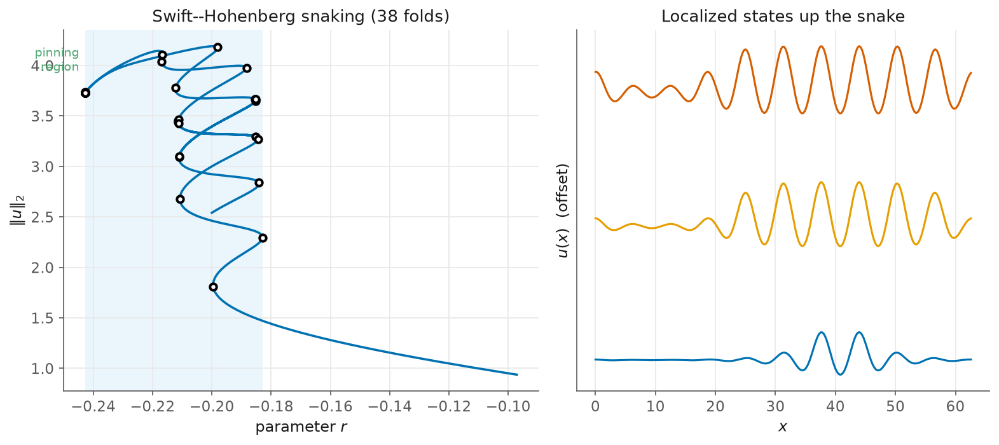

# 5. Homoclinic snaking in Swift–Hohenberg

> Script: [`examples/swift_hohenberg.py`](../examples/swift_hohenberg.py) · run it to regenerate the figure.

This chapter is the showcase of pattern formation, and the problem which
BifurcationKit runs matrix-free on a GPU at $\sim\!10^6$ degrees of freedom. The
Swift–Hohenberg equation (the quadratic–cubic "SH23" form)

$$u_t = -(1+\partial_x^2)^2 u + r\,u + \nu\,u^2 - u^3$$

has, for $\nu$ large enough, a *subcritical* Turing instability off $u=0$ at $r=0$.
Just below the instability, spatially **localized** patterns live on a branch that
**snakes**. Each of the patterns is a patch of rolls in an otherwise flat
background. The branch oscillates back and forth across a narrow *pinning*
interval of $r$, and at every fold the localized state grows by one more pair of
rolls.



## Reaching the snake without branch-switching

The localized branch is disconnected from $u=0$. Tools like BifurcationKit reach
such branches by branch-switching or by deflation, which kellax does not have.
Nevertheless, we do not need them. Indeed, the snake is **one connected branch of
folds**, and such a branch is precisely what pseudo-arclength continuation walks.
To get *onto* the snake, we seed Newton with a localized envelope:

```python
u0 = 1.5 / np.cosh(0.6*(x - L/2)) * np.cos(x - L/2)     # sech envelope of rolls
u, _ = newton(R, u0, r0 = -0.2, tol = 1e-9)             # converge to a localized state
br = arclength_continuation(R, u, p0 = -0.2, ds = 0.02, ds_max = 0.06,
                            n_steps = 700, p_min = -0.30, p_max = -0.10, direction = 1.0)
```

```
snake: 38 folds, pinning region r in [-0.243, -0.183], ||u||_2 0.94 -> 4.19
```

Thirty-eight turning points emerge from a single continuation run. The left panel
shows the snake in a plot of $\lVert u\rVert_2$ against $r$, with the pinning
region shaded. The right panel shows three of the localized states climbing the
snake. Notice that every fold has added a pair of rolls.

## Spectral discretisation, and the matrix-free scale-up

The operator $(1+\partial_x^2)^2$ is diagonal in Fourier space, with the symbol
$(1-k^2)^2$. Thus the evaluation of the residual amounts to two FFTs and involves
no matrix, and the diagonal inverse of the operator is the natural preconditioner.
The example confirms that the **matrix-free** engine snakes on the same problem:

```
matrix-free (GMRES on JVPs, Fourier precond): 12 folds in 2s
```

At $N=256$ the 1-D field is small enough for the dense engine, and the 1-D
tutorial of BifurcationKit uses the same setting. The point lies in the scale-up.
The matrix-free engine takes the *identical* spectral formulation to 2-D and 3-D
at $10^4$–$10^6$ dof, where the Jacobian cannot be formed. This is the regime of
[chapter 4](04-matrix-free.md).

## What to notice

- **Snaking is folds, all the way up.** No new machinery is involved. We run the
  same `arclength_continuation` from [chapter 1](01-the-fold.md), merely seeded on
  a localized state. Arclength sails through all 38 turning points because they
  lie on one connected branch.
- **Seeding is the whole trick.** The absence of branch-switching in kellax is not
  a barrier here. A physically-motivated initial guess, in the form of an envelope
  of rolls, puts us on the branch. Continuation does the rest.
- **This problem drove an engine fix.** Seeding the matrix-free corrector with an
  *already-converged* localized state used to be rejected: the line search of the
  corrector cannot improve an exact point. The engine now accepts a seed which
  already meets the tolerance; see the `matrixfree` corrector.

Background: Burke & Knobloch on homoclinic snaking; Knoll & Keyes (2004) on
Jacobian-free Newton–Krylov.
