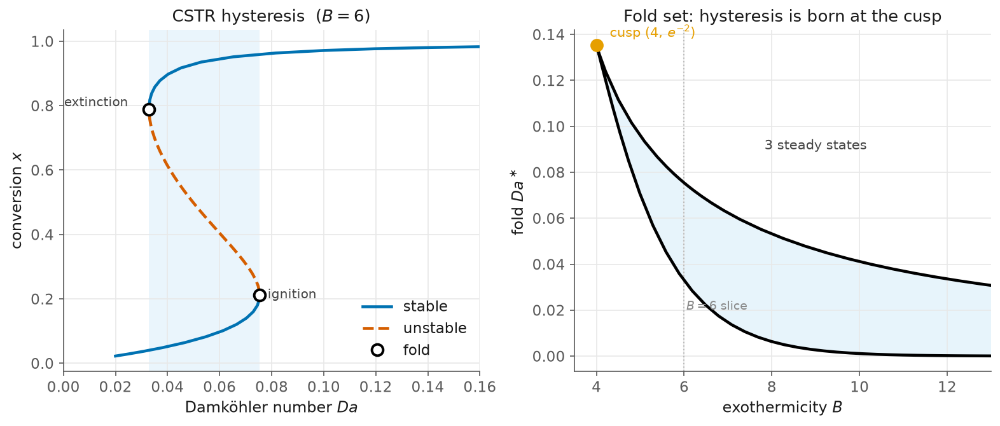

# 6 — CSTR: hysteresis, and where it is born

> Script: [`examples/cstr.py`](../examples/cstr.py) · run it to regenerate the figure.

The exothermic continuous stirred-tank reactor — the textbook case of steady-state
multiplicity in chemical engineering, and a chance to use *both* of the first two
chapters' tools on real physics. In dimensionless adiabatic form the steady
conversion $x$ solves

$$G(x, Da) = -x + Da\,(1-x)\,e^{Bx} = 0,$$

with $Da$ the Damköhler number (residence time) and $B$ the exothermicity.



## The hysteresis loop (a fold at each end)

For $B = 6$ the reactor has three steady states over a window of $Da$: a cold
branch, a hot branch, and an unstable one between. Trace the S-curve and refine
the two folds — the **ignition** and **extinction** points:

```python
R = lambda x, Da: G(x, Da, B=6.0)
br = arclength_continuation(R, jnp.array([0.03]), p0=0.02, ds=0.008, ...)
for i in br.turning_points[:2]:
    xf, Daf, _, _ = refine_fold(R, jnp.array(br.x[i]), float(br.p[i]))
```
```
S-curve at B=6: ignition Da=0.075403 (ref 0.075403), extinction Da=0.032873 (ref 0.032873)
```

Exact agreement with the Uppal–Ray–Poore values. The left panel is the classic
ignition/extinction loop; raise $Da$ past ignition and the cold reactor jumps to
the hot branch, lower it past extinction and it drops back — a hysteresis.

## Where the hysteresis comes from: the cusp

Is the hysteresis inevitable? No — it exists only for $B > 4$. Track a fold in the
*second* parameter $B$ (exactly [chapter 2](02-the-cusp.md)'s `track_fold`, now on a
reactor): the two folds sweep together as $B$ falls and **annihilate at a cusp**,

$$B = 4, \quad x = \tfrac12, \quad Da = e^{-2} = 0.135335.$$

```
cusp: min B=4.0024 (ref 4), Da=0.13518 (ref e^-2=0.13534)
```

The right panel is the fold set in the $(B, Da)$ plane: inside the wedge, three
states; the cusp is the tip where multiplicity is born. This is the same object as
the abstract cusp of chapter 2, now with an engineering meaning — *below* $B = 4$
the reactor is monostable, no matter the residence time.

## What to notice

- **One problem, both tools.** The S-curve uses `arclength_continuation` +
  `refine_fold`; the cusp uses `track_fold`. Nothing here is reactor-specific — it
  is the fold machinery of chapters 1–2 pointed at $G(x, Da)$.
- **Stability is the reactor's.** With $\dot x = G$, the cold and hot branches are
  stable, the middle one unstable — which is exactly why the reactor jumps.

Background: the vault notes *Folds & Moore–Spence* and *Pseudo-arclength continuation*.

Next: [a predator–prey fold pair](07-predator-prey.md) — the same folds in ecology.
