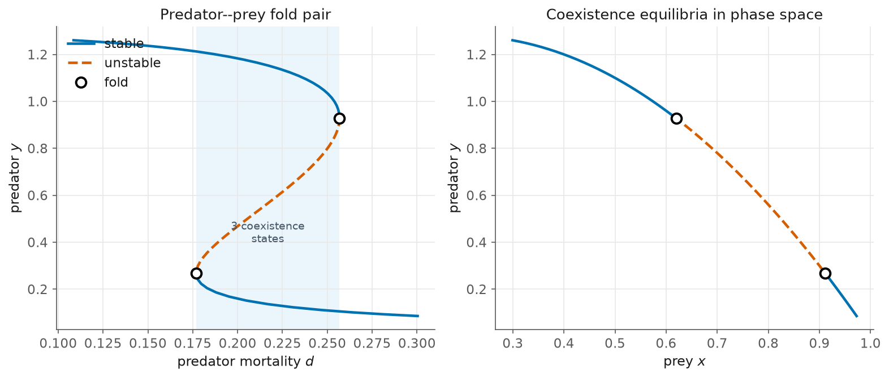

# 7 — A predator–prey fold pair

> Script: [`examples/predator_prey.py`](../examples/predator_prey.py) · run it to regenerate the figure.

Folds are not just a chemistry story. A Rosenzweig–MacArthur predator–prey model
with density-dependent predator loss (MatCont's "EcoMod" tutorial),

$$
\begin{aligned}
\dot x &= r\,x(1-x) - \frac{x y}{x+a},\\
\dot y &= -c\,y + \frac{x y}{x+a} - d\,\frac{y^2}{y^2+b^2},
\end{aligned}
$$

($r=2,\ a=0.6,\ b=c=0.25$), has **three** coexistence equilibria over a window of
the predator-mortality parameter $d$. The outer two appear and disappear at a pair
of folds.



## Sweeping an S-curve in two directions

The coexistence branch is an S in $d$, so — with no branch-switching needed — we
seed one coexistence state *inside* the window and continue **both** ways:

```python
z0, _ = newton(R, np.array([0.79, 0.58]), d0 = 0.22)    # a coexistence equilibrium
for direction in (-1.0, +1.0):
    arclength_continuation(R, z0, p0 = 0.22, direction = direction, ...)
```
```
fold: d=0.176930, x=0.91127, y=0.26820
fold: d=0.256800, x=0.61953, y=0.92799
   ref: d=0.256805 (0.619532, 0.927986); d=0.176927 (0.911266, 0.268200)
```

Both folds match MatCont to five digits. The left panel is the predator density
$y$ against $d$ (the fold pair, three states shaded); the right panel is the same
branch drawn in the $(x, y)$ phase plane — the locus of coexistence equilibria,
folding twice.

## What to notice

- **A 2-D state, the same machinery.** Nothing changed from the scalar chapters
  except that $x$ is now $(x, y)$ and stability is the sign of the leading
  eigenvalue of a $2\times2$ Jacobian. `arclength_continuation` and `refine_fold`
  do not care.
- **Every crossing here is a fold — verified, not assumed.** `analyze_branch`
  computes the spectrum along the branch and classifies each stability change;
  on this branch, in this window of $d$, both changes are the real crossings of
  the two folds, and no complex pair crosses at all. (An earlier draft asserted
  a Hopf on this branch; the spectrum says otherwise, so the claim went.) Hopf
  detection and Newton-exact refinement are in the library — `refine_hopf` is
  validated on the Hopf normal form and on the Brusselator at $b = 1+a^2$ — and
  periodic-orbit continuation from a Hopf point remains the roadmap item.

Background: Kuznetsov, *Elements of Applied Bifurcation Theory* (the model is
MatCont's EcoMod tutorial).

Next: [Bratu in 2D](08-bratu-2d.md) — a fold of a genuine 2-D field.
