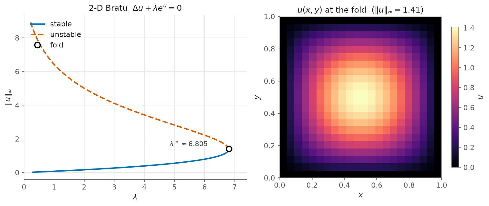

# 8 — Bratu in 2D: a fold of a PDE field

> Script: [`examples/bratu_2d.py`](../examples/bratu_2d.py) · run it to regenerate the figure.

Back to ignition, now on a surface. The Bratu–Gelfand problem on the unit square
(BifurcationKit's `mittelmann` is a close relative):

$$\Delta u + \lambda\, e^{u} = 0 \quad\text{on } (0,1)^2, \qquad u = 0 \text{ on the boundary}.$$

As in 1D there are a cool and a hot branch meeting at a fold — but now $u(x,y)$ is a
2-D thermal field, a bump pinned to zero on the boundary.



## The fold of a 2-D field

Discretise with the 5-point Laplacian on a $20\times20$ interior grid (400 dof) and
continue in $\lambda$:

```python
def R(u, lam):                                  # u is the flattened N x N field
    U = u.reshape(N, N)
    lap = (roll_up + roll_dn + roll_lt + roll_rt - 4*U) / h**2
    return (lap + lam*np.exp(U)).reshape(-1)

br = arclength_continuation(R, np.zeros(N*N), p0 = 0.3, ...)
_, lam_f, _, _ = refine_fold(R, np.array(br.x[i]), float(br.p[i]))
```
```
2-D Bratu (N^2 = 400 dof): refined fold lambda* = 6.80469   (unit-square ref ~6.808)
```

The turning point sits at $\lambda^\ast \approx 6.808$, higher than the 1-D value
$3.5138$ because the square sheds heat through more boundary. The right panel is the
solution *at the fold* — a smooth thermal bump, $\lVert u\rVert_\infty \approx 1.4$.

## What to notice

- **From a line to a field, unchanged.** The call is identical to
  [chapter 3](03-bratu.md); only the residual now returns a flattened 2-D
  Laplacian. Autodiff differentiates through the `reshape` and the 5-point stencil
  without comment.
- **The scaling path.** 400 dof is comfortable for the dense engine; a finer 2-D
  (or a 3-D) grid is matrix-free territory — the GMRES-on-JVP engine of
  [chapter 4](04-matrix-free.md), which reaches $10^4$–$10^6$ dof. *(One caveat,
  logged honestly: the matrix-free engine's **preconditioned** solve currently
  stumbles on this 2-D residual at the initial step — a known rough edge; the 1-D
  matrix-free path in chapter 4 is solid.)*

This is the last written chapter. The book grows with the example suite — a
predator–prey Hopf, branch-switching at pitchforks, and differentiable
continuation come next (see the roadmap in the [README](../README.md)).
