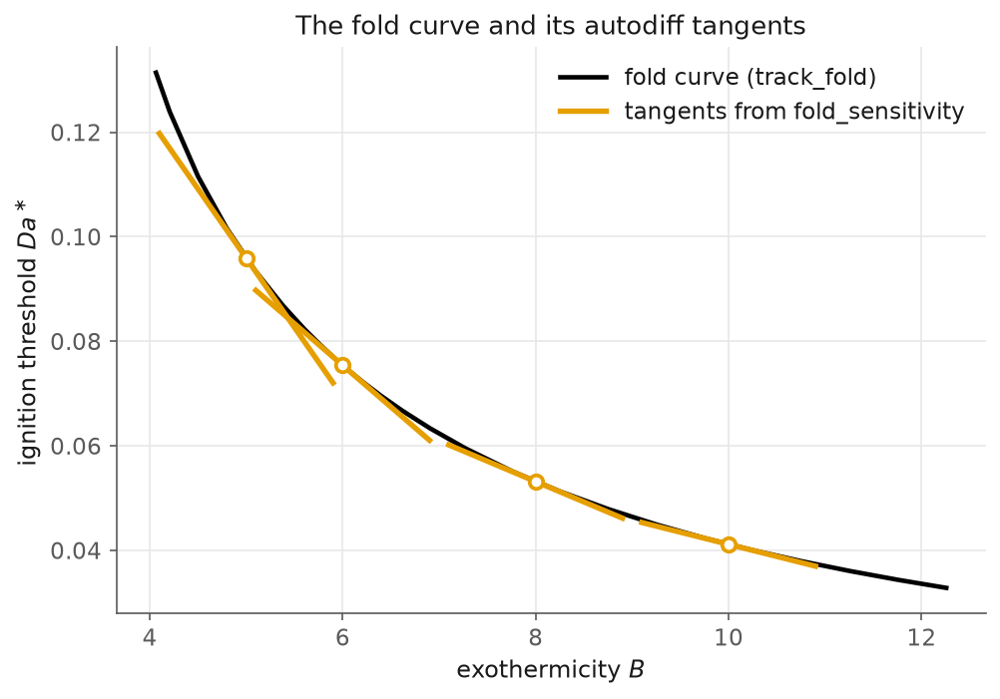

# 9. Differentiable continuation: the gradient of a fold

> Script: [`examples/cstr_sensitivity.py`](../examples/cstr_sensitivity.py) · run it to regenerate the figure.

Every chapter so far has *located* structure: folds, cusps, branch points,
and Hopf candidates. In the present chapter we differentiate it. The question
we pose is concrete. The CSTR of [chapter 6](06-cstr.md) ignites at a fold
$Da^\ast(B)$, and the quantity of interest amounts to the response of this
threshold to a change in the exothermicity $B$.

## One linear solve, not a difference quotient

The fold state $z^\ast = (x^\ast, Da^\ast, v^\ast)$ solves the Moore–Spence
system of [chapter 1](01-the-fold.md), now regarded as a function of the model
parameter $B$:

$$G(z;\,B) = 0.$$

The Jacobian $G_z$ remains non-singular at a generic fold. Indeed, this
non-singularity underlies the convergence of Moore–Spence Newton in the first
place. By the implicit function theorem, the fold sensitivity then follows
directly:

$$\frac{dz^\ast}{dB} = -\,G_z^{-1}\,G_B,$$

and $d(Da^\ast)/dB$ forms one row of it. The cost amounts to a single linear
solve against the same Jacobian, and $G_B$ comes from `jax.jacfwd`. No
unrolling of the Newton iterations enters here, and finite differences are
avoided entirely. In kellax this construction goes by the name of
`fold_sensitivity`. It returns the fold state, its location, and the exact
gradient in one call.

## Validation, twice

We validate against the closed-form law first. For the cubic $x^3 - \theta x + p$,
the fold lies at $p^\ast(\theta) = 2(\theta/3)^{3/2}$, and so
$dp^\ast/d\theta = \sqrt{\theta/3}$. Here `fold_sensitivity` returns this value to
$10^{-9}$, and a finite difference of two *refined* folds agrees with it to
$10^{-5}$. Both of these checks are carried in the test suite.

We then turn to the reactor. Here `track_fold` traces the ignition curve
$Da^\ast(B)$ point by point, and `fold_sensitivity` differentiates it
point-wise:

```
    B        Da*    d(Da*)/dB  curve slope
  5.0   0.095906   -2.651e-02   -2.533e-02
  6.0   0.075403   -1.593e-02   -1.559e-02
  8.0   0.053167   -7.786e-03   -8.408e-03
 10.0   0.041153   -4.638e-03   -4.923e-03
```

The residual disagreement of roughly $10^{-3}$ reflects the sampling error of
the *curve* itself. It arises from a central difference over the tracker's
adaptive steps, and it does not stem from the gradient. The tangent segments,
drawn from the implicit gradient, lie on the tracked curve:



## What to notice

- **The gradient is a by-product of convergence.** Everything needed for the
  sensitivity already exists by the time Newton finishes: the Jacobian $G_z$, its
  factorisation, and the converged state $z^\ast$. The marginal cost then amounts
  to one Jacobian evaluation in $B$ and one back-solve.
- **This is why kellax is written in JAX.** The system $G$ contains second
  derivatives of the residual, namely the $d(R_x v)/dx$ block, and $G_B$ calls
  for mixed derivatives in the model parameters. All of it follows from
  `jax.jacfwd`, applied to code written once for the residual alone.
- **The payoff is optimisation against the diagram.** A differentiable
  $Da^\ast(B)$ allows a gradient method to *place* an ignition threshold. A model
  can be fitted so that its fold sits at a prescribed value, or the width of a
  hysteresis loop can be fixed in advance. This inverse use of bifurcation
  analysis provides the research motivation behind kellax, and the present
  chapter marks its first working piece.

This is the last written chapter. The book grows with the example suite, and
the continuation of periodic orbits from Hopf points forms the next major
front, as noted in the roadmap of the [README](../README.md).
