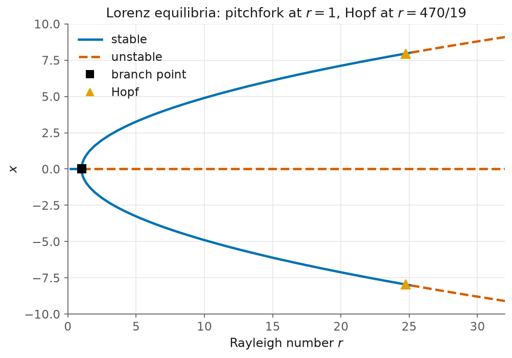

# 10. The Lorenz equilibria: a pitchfork, and the Hopf that ends it

> Script: [`examples/lorenz.py`](../examples/lorenz.py) · run it to regenerate the figure.

The Lorenz system is known for its attractor. We ignore the attractor here and
ask a question about equilibria instead. For

$$\dot x = \sigma (y - x), \qquad \dot y = x(r - z) - y, \qquad \dot z = xy - bz$$

with $\sigma = 10$ and $b = 8/3$, we want the whole set of steady states as the
Rayleigh number $r$ varies, together with the parameter values at which that
set changes. The problem is a good closing example because every part of the
bifurcation layer appears on it, and because the answers are known in closed
form.

## The structure a fold detector cannot see

The origin solves the system for every $r$. Continuing it is therefore trivial,
and that is exactly the difficulty. The branch is a straight line, its tangent
never turns, and the fold detection of [chapter 1](01-the-fold.md) reports
nothing at all. Yet at $r = 1$ the origin loses stability and a pair of
convection states is born.

What changes at $r = 1$ is not the geometry of the branch but its spectrum. A
real eigenvalue of $\partial R/\partial x$ crosses zero while the tangent
carries on unbothered. This is the distinction `analyze_branch` is built on: it
computes the spectrum at every accepted point and classifies each axis crossing
by what crosses and by whether a turning point sits nearby. A real crossing at
a turning point is a fold, a real crossing away from one is a branch point, and
a complex pair is a Hopf candidate.

```
trivial branch: 271 points, r in [0.200, 32.112]
  branch points detected: 1  -> r = [1.000232]   (exact 1.0)
branch_off returned 2 seed(s) at the pitchfork
```

The estimate $r = 1.000232$ is a linear interpolation between two accepted
points, and it is not meant to be the answer. It is a seed. `branch_off` takes
it, builds the bifurcating tangent from the second null vector of the bordered
matrix, and returns one seed on each side of the pitchfork.

## Continuing the pair, and pinning the Hopf

Each seed continues as an ordinary branch. The convection states are known,
$C_\pm = (\pm\sqrt{b(r-1)},\, \pm\sqrt{b(r-1)},\, r-1)$, so the traced branch
can be checked against them directly:

```
convection branch: traced to r = 32.036; |x| = 9.097445 vs exact 9.097445  (err 0.0e+00)
  Hopf candidates on it: 1  -> r ~ [24.7383]
```

The spectrum on this branch produces a crossing of a different kind, a complex
conjugate pair, and `analyze_branch` labels it a Hopf candidate. Again the
location is only interpolated. `refine_hopf` then solves the augmented
$(3N+2)$ system, in which the state, the parameter, the frequency and the
critical eigenvector are all unknowns, and the second derivatives it needs come
from `jax.jacfwd`:

```
refine_hopf: r_H = 24.736842105  (exact 24.736842105, err 3.55e-15)
             omega = 9.624530064  (exact 9.624530064, err 1.78e-15)
             residual 3.24e-15
```

The reference values deserve a word, because one of them was wrong in the first
draft of this chapter. The Hopf location is the classical
$r_H = \sigma(\sigma + b + 3)/(\sigma - b - 1) = 470/19$. The frequency is
easier to get wrong. At $C_\pm$ the characteristic polynomial is
$\lambda^3 + a_2\lambda^2 + a_1\lambda + a_0$ with $a_1 = b(\sigma + r)$; a
cubic has a pure imaginary pair exactly when $a_2 a_1 = a_0$, and then
$\omega^2 = a_1$. So $\omega_H = \sqrt{b(\sigma + r_H)} = 9.6245301\ldots$ A
formula missing the factor $b$ gives $5.89$, and it was kellax that was right.

## Three solutions, from one guess

The branch structure above was found by following curves. The same equilibria
can be found without following anything, by deflation. Starting from the single
guess $(1,1,1)$ at $r = 28$, plain Newton finds one root; each further root is
found by solving a deflated system that cannot converge to anything already
known:

```
deflated_search at r = 28.0: 3 distinct equilibria
    x = -8.485281  y = -8.485281  z = +27.000000
    x = +0.000000  y = +0.000000  z = -0.000000
    x = +8.485281  y = +8.485281  z = +27.000000
    exact: x = 0 and x = +/-8.485281, z = 27.0
```

One control matters here and is worth stating plainly. With the default
`seed_scale = 0` the search returns only the origin, because deflation alone
never moves the iterate far enough to find $C_\pm$. A perturbation scale
comparable to the size of the state, `seed_scale = 10`, recovers all three. The
parameter is not cosmetic and the default will not always serve.



## What to notice

- **Fold detection and stability analysis answer different questions.** A fold
  is a property of the branch as a curve, and a branch point is a property of
  its spectrum. A pitchfork is invisible to the first and obvious to the
  second, which is why `analyze_branch` exists as a separate layer over
  `arclength_continuation` rather than as part of it.
- **Interpolated candidates are seeds, not answers.** Everything the classifier
  returns is a linear interpolation between accepted points, good to the step
  size and no better. The refinement stages turn a seed into an answer, and
  here they do so to $10^{-15}$.
- **Check the closed form, and then check the closed form.** The frequency
  reference in this chapter was wrong on the first attempt and the library was
  right. Validation is only worth something when the reference is derived
  rather than remembered.
- **Deflation and continuation are complementary.** Continuation finds what is
  connected to where you started. Deflation finds what is not. The Lorenz
  equilibria are reachable both ways, which is what makes them a fair test of
  each.
