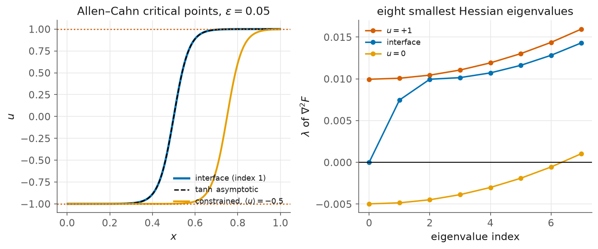

# 11. The inner solvers: a phase field, its transition state, and the Morse index

> Script: [`examples/allen_cahn.py`](../examples/allen_cahn.py) · run it to regenerate the figure.

Every previous chapter has traced a branch. This one does not. It exercises the
layer underneath the continuation engines, the one kellax inherited from the
classical density-functional toolbox it was extracted from, and which arrived
in the library at v0.5. There are four pieces: a fixed-point globaliser, a
matrix-free Newton-Krylov endgame, autodiff Hessian spectra, and the
implicit-function-theorem seam.

The problem is Allen-Cahn on $[0,1]$ with Neumann ends, whose energy

$$F[u] = \int_0^1 \tfrac{\varepsilon^2}{2}\,(u')^2 + \tfrac14 (u^2-1)^2\,dx$$

has two uniform minima $u = \pm 1$, and between them a single interface: the
state a nucleating system has to pass through. The critical points solve

$$R(u) = \varepsilon^2 u'' + u - u^3 = 0.$$

We take $\varepsilon = 0.05$ on $N = 201$ cells.

## The residual and the energy must agree

Morse indices only mean something if the Hessian being diagonalised belongs to
the energy whose critical points the residual finds. The script therefore
begins by checking that the discrete residual is exactly minus the discrete
energy gradient, rather than assuming it:

```
grad F  vs  -h R : max mismatch 2.56e-17
```

## Climbing the ladder

The fixed point of the semi-implicit step
$(I - \Delta t\,\varepsilon^2 D_2)u_{\text{new}} = u + \Delta t(u - u^3)$
solves $R(u) = 0$. `fixed_point_solve` runs it, first as damped Picard and then
with Anderson (DIIS) extrapolation over the last $m$ residual differences:

```
Picard  (m=0):    35 iterations, residual 5.63e-09
Anderson(m=5):    13 iterations, residual 3.43e-10   (2.7x fewer)
newton_krylov finishes: 1 Newton steps, residual 4.50e-14, converged=True
```

The division of labour is the point. Anderson is cheap and robust and gets to
$10^{-10}$ from a poor starting guess; it is not the tool for the last four
digits. Newton-Krylov takes that state and finishes in a single step, because
by then the guess is well inside the quadratic basin.

One default deserves a warning, and it is the clearest trace of where this code
came from. `fixed_point_solve` floors every iterate at $10^{-30}$, which is
correct for a density and fatal for a signed order parameter: the negative
phase would be clipped to zero on the first sweep. A phase field must pass
`clamp = None`.

## Classifying by index

`morse_index` counts the negative eigenvalues of $\nabla^2 F$ by matrix-free
Lanczos, never forming the Hessian. Applied to the three critical points:

```
critical point        R residual     index   smallest eigenvalue
  uniform u=+1       0.00e+00      0     +9.950249e-03
  interface          4.50e-14      1     -2.523937e-13
  uniform u=0        0.00e+00      7     -4.975124e-03
  (u=0 index counts modes with eps^2 (k pi)^2 < 1: exact 7)
```

The uniform state is a minimum, and $u = 0$ has exactly the seven unstable
modes predicted by $\varepsilon^2 (k\pi)^2 < 1$. The interface is reported as a
saddle of index one, which is the expected answer for a transition state.

But look at the eigenvalue that claim rests on. It is $-2.5 \times 10^{-13}$,
and no sign should be believed at that magnitude. The mode in question is
translation: a centred interface is drawn to the nearer wall, and the pull is
exponentially weak in $1/\varepsilon$. Whether the computed sign is physics or
rounding cannot be settled at one value of $\varepsilon$, so the script sweeps
it:

```
   eps    smallest eigenvalue of the interface   index
  0.05          -2.530e-13                1
  0.10          -3.450e-07                1
  0.15          -3.850e-05                1
  0.20          -4.058e-04                1
  0.25          -1.616e-03                1
```

The eigenvalue emerges from the noise with one consistent sign and grows
monotonically. The index-one claim is safe, and it is the sweep rather than the
single number that makes it so.

## The interface energy, and a constraint

The excess energy of the interface should approach the classical surface
tension $(2\sqrt2/3)\,\varepsilon$ as $\varepsilon \to 0$:

```
interface excess energy 0.047133  vs  (2 sqrt2/3) eps = 0.047140   (ratio 0.9998)
```

Fixing the mean of $u$ turns the problem into the conserved equilibrium:
$R(u) + \lambda = 0$ subject to $\langle u \rangle = m$, with $\lambda$ the
chemical potential. This is what `make_step_bordered` is for. The constraint
rides in the border row and the whole $(N+1)$ system is solved by one GMRES, so
the near-null direction of $\partial R/\partial u$ is regularised inside the
Krylov space rather than by an explicit Schur complement against it:

```
prescribed mean    lambda (chemical potential)    residual
     -0.90            +1.7100e-01              4.4e-16
     -0.50            +5.8100e-06              4.0e-10
     +0.00            -4.2664e-17              1.6e-14
     +0.50            -5.8100e-06              4.0e-10
     +0.90            -1.7100e-01              4.4e-16
```

The chemical potential is zero across the coexistence window, which is the
Maxwell construction for a symmetric double well, and lifts only when the
interface is close enough to a wall to feel it. Seeding matters here in a way
worth recording: the interface must be placed near where the constraint wants
it, at $x_0 = (1+m)/2$. Seeded from the centred interface instead, every solve
with $|m| \gtrsim 0.8$ stalls near $\langle u \rangle = -0.80$. A bordered
Newton step corrects an interface. It does not transport one across a domain.



## The gradient through the solve

Finally, `ift_injection` attaches the exact $du^*/d\varepsilon$ to a converged
solution, so that a quantity computed from $u^*$ can be differentiated in the
model parameter without unrolling the solver:

```
dF/d(eps) by IFT +0.94296492   by central difference +0.94296492   (agree to 6.5e-12)
```

That number is worth a second look. $dF/d\varepsilon = 0.94296$, and
$2\sqrt2/3 = 0.942809$. The derivative of the interface energy with respect to
$\varepsilon$ *is* the surface tension, recovered here to four digits by one
linear solve.

## What to notice

- **The ladder is a division of labour, not a ranking.** Anderson is the right
  tool far from the solution and the wrong one near it; Newton-Krylov is the
  reverse. Thirteen Anderson iterations plus one Newton step beats either alone.
- **A default carries its origin with it.** The positivity floor in
  `fixed_point_solve` is correct for the densities it was written for and
  destroys a signed field. Consolidating code across domains means auditing its
  defaults, not just its interfaces.
- **An index is only as trustworthy as the eigenvalue under it.** At
  $\varepsilon = 0.05$ the interface's critical eigenvalue is $10^{-13}$. The
  number is reported honestly by the library; deciding whether to believe it
  took a parameter sweep.
- **The constraint belongs in the border row.** Prescribing the mean is exactly
  the bordered structure that Keller's method uses for arclength, applied to a
  different condition, and it is solved by the same primitive.
